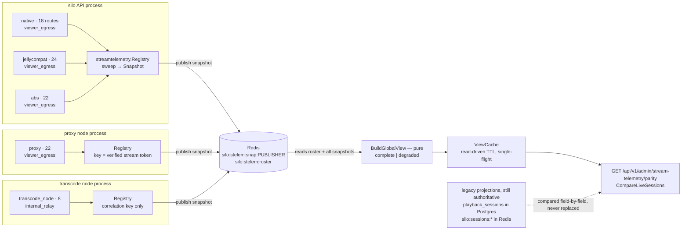
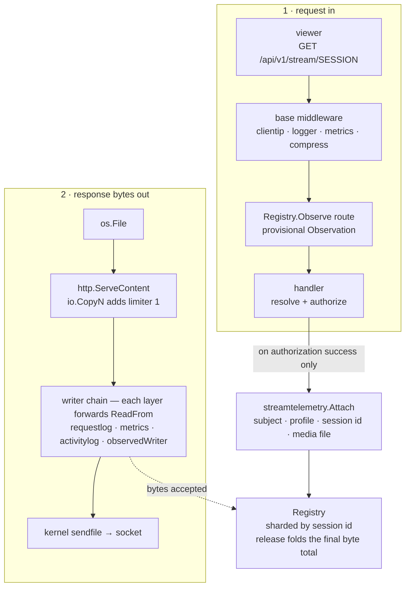

# Stream Telemetry

> **Status.** P0 (a–d) is **built** on `feat/stream-telemetry-enforcer`, cut from `main`
> @ `edd919c5`. It observes only: nothing is blocked, throttled, cut or banned.
> Enforcement (P1), harvest (P2) and heuristics (P3) are **deferred** — see §3 and §5.
>
> **Validated in production.** An 18-hour soak on a live deployment (185 samples,
> `native` + `jellycompat` enabled) held at 183/183 complete views, zero build failures,
> zero stale views, and a merge cost of 3 ms median / 10 ms p95 / 52 ms max. See §6.
>
> **Section numbers are load-bearing.** Go comments cite `§2.2`, `§2.5`, `§4.2`,
> `§4.2b`, `§4.4`, `§6` and `§7.1` directly. Renumbering breaks those references.
> §3 and §5 are intentionally kept as stubs rather than renumbered away.
>
> **Companion:** [stream-telemetry appendix](2026-08-17-stream-telemetry-appendix.md) —
> approaches tried and discarded, revision history, and the prior-art trail. Read it
> before proposing anything that looks like a simplification; most simplifications
> here have already been tried and have a recorded reason for failing.
>
> **Related:** [streaming write deadlines and writer-chain conformance](../architecture/streaming-write-deadline.md) —
> the writer-chain conformance rules §4.4 depends on.

---

## In plain language

**The problem.** The server can count how many streams a user has open, but not how
many *bytes* they pull, from which addresses, at what rate, or through which node. A
concurrency cap therefore cannot see a ripper: one session downloading the whole
library at link speed looks exactly like one person watching a film. There is also no
single place to look — proxy health, admin sessions, node sessions and playback stats
each answer a different part of the question from a different store.

**What P0 built.** Every byte-serving route in every process now reports what it
served, to whom, and how fast, into one merged picture — asynchronously, off the hot
path, and without trusting anything the client says. Five router families across three
kinds of process publish into Redis; a pure function merges them; an admin endpoint
serves the result and diffs it against the two projections admins read today.

**What P0 deliberately does not do.** It makes no decisions. No request is denied,
delayed or cut, and no existing admin read has been repointed onto it. Judgement —
which rate is a rip, which session to cut, who to suspend — is deferred on purpose:
a threshold set before the traffic has been measured is a guess, and this is the thing
that does the measuring. Monitoring becomes first-class here; enforcement is built on
top of it afterwards, against real distributions.

---

## Architecture at a glance

### Figure 1 — five families, three processes, one merge



Every arrow crosses a process or store boundary; nothing on the left reads anything on
the right. The dashed edge is what P0d deliberately did **not** cut over — the parity
endpoint reads those two stores only to diff against them (§6).

### Figure 2 — what one observed request touches



The observer is one `http.Handler` wrapper plus one `ResponseWriter`; everything else
the registry does happens on a sweep goroutine. Two properties of this picture are
load-bearing and were each got wrong once before:

- **The attach seam is authorization success, not response status** (§4.2). It lands
  *before* a manifest handler starts a transcode, which is what will let a P1 cut
  prevent that side effect instead of cleaning up after it.
- **`CopyChunked` slices the caller's limiter rather than nesting a new one** (§4.4).
  Go's kernel `sendfile` path unwraps exactly one `io.LimitedReader`, so nesting one
  per accounting layer silently forfeits sendfile for the whole chain.

### Figure 3 — where the code went

5,405 added production lines across 64 files. Two thirds are in one package, and the
categories most likely to read as scope creep are the two that are not telemetry.

| Destination | Files | Lines | Share |
|---|---:|---:|---|
| `internal/streamtelemetry` | 16 | 3,495 | `███████████████████` 65% |
| route wiring & call sites | ~22 | 637 | `███` 12% |
| per-family declarations | 10 | 637 | `███` 12% |
| admin read path | 3 | 294 | `█` 5% |
| writer-chain conformance | 10 | 282 | `█` 5% |
| identity prerequisites | 2 | 60 | ` ` 1% |

Per-family cost is ~64 lines: one route table and one identity-capture function. The
declarations cannot move into the core package without it importing all five router
families. Writer-chain conformance and identity prerequisites are not telemetry at all
— they are §4.4 and §6/P0a, and both fix defects that predate this work.

---

## 0. What this builds on

Two things on `main` are load-bearing here:

- **`internal/httpstream.RollingDeadlineWriter`** — stall detection, outcome
  classification, and a `ReadFrom` that preserves sendfile. Note *how*: a direct
  `s.w.(io.ReaderFrom)` assertion. `io.Copy` discovers `io.ReaderFrom` the same way and
  **never consults `Unwrap()`**, so any wrapper that does not itself implement
  `ReadFrom` drops the whole chain to userspace copying. This governs §4.4.
- **`internal/clientip`** — a trusted-proxy boundary resolver. Before P0a it was
  mounted on the native and jellycompat routers **only**, so `clientip.FromContext`
  returned nothing at exactly the edges where viewer fan-out has to be observed.

`main` contains none of the earlier `feat/sauron-async-enforcer` work. What was kept
from it is ideas, not code: server-observed existence rather than client-reported
liveness; every reason collapsing to a small set of enforcement actions; the hot path
paying at most one in-memory lookup; the `Route` dimension; and the finding that
*every* byte-serving surface must be enrolled or the picture lies. What was
deliberately not repeated is listed in the appendix.

---

## 1. Requirements

1. Every playback session reports into a central picture: bytes served, to which IP, at
   what rate, direct/remux/transcode, which node.
2. Reporting is **off the hot path** — bytes go out first, telemetry follows.
3. **Never trust the client.** Liveness and volume are server-observed.
4. **One implementation** for integrated and multi-node, not two code paths.
5. **No full restart resiliency yet.** Durable state is limited to *sanctions* (appendix E, former §3.4)
   — both `suspend` and `ban`. Durability and permanence are separate axes: a suspend
   is durable *and* reversible.
6. Keep Postgres off the hot path and out of high-volume enforcement work.
7. **Bound volume, not just concurrency.** A stream cap counts sessions and is blind to
   how many bytes flow through them (appendix E, former §5.2).
8. **One place to look.** All of the above resolves against a single monitoring
   picture, not a per-feature side channel.

---

## 2. The unit of accounting: logical sessions, not requests

### 2.1 Why a request is not a session

Making the in-flight HTTP transfer the unit fails in both directions, and no tuning
fixes it:

- **Short transfers vanish.** An HLS segment, a subtitle, a small Range or a LAN-speed
  download can begin and complete entirely between two collector sweeps.
- **One pour is counted many times.** Concurrent Range requests open several meters; a
  proxied segment is metered at proxy egress and again at transcode-node egress.
- **Identities genuinely differ.** Native logical session ids and remote transcode
  transport ids are deliberately distinct in current code.

Aggregation is therefore unavoidable. The fix is to make every observation
**homogeneous and role-tagged**, then fold them into one canonical accumulator —
rather than reconciling two incompatible models after the fact.

### 2.2 Three-level model — as built

```
Observation (per HTTP request)  →  LogicalSession / Transfer  →  Snapshot
role: viewer_egress                keyed by canonical sid        per publisher
    | internal_relay                first-seen StartedAt          instance
    | producer                      folded byte total
                                    liveness signals
```

**`Observation`** — one per in-flight request, carrying an identity resolved once at
entry and an explicit `Role`. It counts bytes but creates no logical activity; a
request that never attaches is reported only through the unattributed counters.

The **request-time capture set** exists because anything sampled at request time cannot
be recovered later — the request is gone. Anything derivable from stored data (geo/ASN
from IP, rates from bytes and timestamps) can wait.

| Field | Why |
|---|---|
| `ClientName`, `ClientVersion`, `ClientBuild`, `ClientChannel`, `ClientUserAgent` | Separates a real player from `curl` or a scraper. Client-side anomalies are usually meaningless until grouped by user agent. |
| `DeviceID` | One account across forty devices is a strong sharing signal. |
| `Outcome` (`completed` / `stalled_reap` / `client_gone`) | A ripper **completes**; a browser **aborts**. Already classified by the rolling deadline writer — free to record. |
| `TokenIssuedAt` | Enables "how many distinct sessions is one token driving" — the cheap probe for token hoard/replay. |
| `RequestCount` (per session, per window) | Low-byte, high-work abuse (manifest/seek/replan storms) is invisible to a byte counter. |

Each family supplies its own capture function, because identity lives in a different
place per protocol: native reads `X-Silo-*` headers, jellycompat parses the
`MediaBrowser` authorization header (the same parser the negotiation path uses, so
telemetry reads the value the play session was keyed on), ABS carries a numeric account
id as a string, and the transcode node has none of these.

**Roles** are assigned at route declaration, never inferred. This single field is what
stops relay double-counting:

| Role | Meaning | Counts toward cap? | Counts toward bytes? |
|---|---|---|---|
| `viewer_egress` | bytes leaving to an actual viewer | yes (if cap-relevant route) | yes |
| `internal_relay` | proxy→node, artifact fetch, server-to-server | **no** | no (correlated only) |
| `producer` | transcode job activity, no viewer bytes | no | no |

**`LogicalSession`** — the canonical unit, keyed by canonical session id. It owns
`StartedAt` (first seen, never rewritten), a monotonic `BytesServed` accumulator, the
liveness signals of §2.4, the bounded viewer-IP set, and route/method/node attribution.
**Every observation folds its final total in on release**, so a transfer that lives and
dies between sweeps is still counted; the sweep reads in-flight deltas, and release is
what makes it lossless. A retention window after the last observation ends keeps the
session alive across the gaps between HLS segment requests.

> **Trap, cost one full remediation round:** `Registry.Snapshot()` reports
> `lastSweptBytes`, not live bytes — only `Sweep()` folds live observations. Any test
> asserting a byte total must call `Sweep()` first. Both methods carry a doc comment
> saying so.

**`Snapshot`** — one publisher instance's complete set of sessions and transfers at an
instant, plus `capturedAt` and a publisher heartbeat.

**Bounds.** The registry has exact CAS-reserved global limits plus per-session limits.
When a limit is reached the request still proceeds; the snapshot becomes `Truncated`,
monotonic dropped counters grow, and the registry emits at most one warning per minute.
Bounded sets drop the newest value and expose their own overflow flag. Saturation
serving through is a P0 decision — a fail-closed download policy belongs to P1.

### 2.3 Transport: a `SnapshotStore` in every mode, never `nil`

An explicit `SnapshotStore` interface with a **local in-process implementation** rather
than `nil`, plus a Redis implementation. Every publisher — each API replica, each
proxy, each transcode node — publishes under a **random process-unique instance id**,
with logical node identity carried as a separate field. A node hash derived from
`nodeURL` is not process identity: instances sharing a public URL collide.

Stated plainly here and in the code: **synchronous admission remains per-process; this
is a cross-replica backstop, not a replacement for it.**

### 2.4 Liveness: bytes are primary, not sole

Bytes alone miss HLS buffer-ahead (a client can legitimately make no request for
minutes), seek discontinuity, a paused stream, a transcode still burning CPU after the
last served byte, and a request in flight that has not yet served a byte. Three
**separately server-observed** signals live on the `LogicalSession`. None is
client-reported and none is a state machine, so this does not become a second lifecycle
model competing with `playback.SessionManager`:

- `openObservations` — how many observations are in flight right now.
- `lastByteAccepted` — the byte clock; authority for volume and viewer activity.
- `realtimeConnectionAlive` — an open, ping-checked WebSocket, used only for the
  paused-session exemption (issue #243). An *observed connection*, not a reported
  position.

Cap relevance is derived at evaluation time from these, never stored as a state. No
client progress timestamp enters enforcement.

**Producer activity does not live on the `LogicalSession`.** A transcode job counts
toward neither the cap nor viewer bytes. A `JobView` is the natural carrier but is
**deferred without a phase** (§6): a live job snapshot cannot count jobs *started* over
a window, and the node request carries only a transport session id with no canonical
owner.

### 2.5 The global view — as built

Rules never read snapshots; they read a `GlobalMonitoringView` built by merging every
fresh publisher snapshot. `BuildGlobalView` is a **pure function** — its input carries
the roster, decoded snapshots, errors, the build time and all bounds; it reads neither
a clock nor Redis. That is what lets every rule below be unit-tested in CI with neither
Postgres nor Redis, and it is the property to copy for P1's evaluator.

| Field | Merge rule |
|---|---|
| Session id | Canonical join key. Remote transport ids correlate to it explicitly; they are never treated as sessions. |
| Subject, profile id, media file id | **Only viewer-egress publishers contribute.** Populated disagreements retain all attributed values, flag a conflict, and leave the scalar zero. |
| `StartedAt` | Highest source rank (`claim`, `session`, `issued_at`, `first_seen`), then earliest value at that rank. **Degradation is viewer-edge-owned** — a relay's publisher-local first-seen stamp must not degrade an authoritative viewer-edge session. |
| Viewer bytes | Sum **only** viewer-egress routes. Never `SessionView.BytesAccepted`, which includes every role. |
| Relay bytes | Summed separately, for correlation only. |
| Open observations, requests | Saturating sum. |
| Liveness timestamps | Latest. Realtime connection is logical OR. |
| Viewer IPs and captured sets | Bounded, naturally sorted **unions** with overflow flags — never latest-wins, which would collapse the fan-out signal to one address. |
| Routes | Union by method, pattern and role; counters use saturating sums. |
| Play method | Union plus per-publisher values. **There is no invented scalar winner.** |
| Transfers | Never merged across publishers; keyed by publisher id plus transfer id. |
| Stale publisher | Dropped wholesale past the freshness bound; its heartbeat distinguishes a stalled publisher from a dead node. |

**Identity disagreement records and surfaces *both* values.** It never picks an edge
arbitrarily and never quarantines the row. Two frontends can reconstruct the same
session and disagree; the conflicting values are carried side by side and flagged for
the admin view with a prominent warning, because a disagreement is itself a possible
abuse signal and hiding it defeats the purpose of the system. **Monitoring records and
surfaces only — no automated reaction, no resolution logic.** What a conflict *means*
is deferred to P1 or later. Media-file disagreement is both a conflict and a union,
because a legitimate replan can touch more than one file.

**The view epoch** is the first 16 bytes of SHA-256 over the sorted publisher
`(publisherID, epoch, sequence)` tuples. It is an idempotency key, not an ordering:
epochs are equal or different, never earlier or later.

**Completeness needs a membership contract, not just freshness.** A heartbeat says a
publisher is alive; it cannot say which publishers *must* be present before a decision
is safe. A publisher whose heartbeat is older than the membership TTL has departed and
does not block completeness; a roster member without a usable fresh snapshot is stale,
excluded, named in `MissingPublishers`, and does block it. `Complete` is true only when
all four hold:

1. no publisher is missing or stale;
2. no merged snapshot is truncated;
3. the reader hit no publisher/session/transfer cap;
4. no publisher has decode errors, a count mismatch, or an oversized hash.

**What the flag buys is telling blindness apart from absence.** A session that leaves
the view because the viewer closed the player, one whose bytes stop growing because the
client is buffered ahead, and one that disappears because its publisher stalled are
three different facts producing the same observation. Only the flag separates them.

The damaging case is not a strange rate but an aggregate that under-counts and so fails
open: a per-user stream total sums across publishers, so losing one publisher makes six
streams read as two and a cap derived from it admits more. `BytesServed` is monotonic
**within a publisher**; the merged sum carries no such guarantee, because two
publishers can contribute viewer bytes to the same canonical session once the proxy and
ABS families are enrolled. **Consumers must not derive per-user aggregates, caps or
deltas from an incomplete view.**

**A publisher that cannot reach Redis never joins the roster.** It is invisible to the
view rather than degrading it; P1 must not read that as safe completeness.

**Election, when P1 needs it, must be fenced.** A total order only agrees on identical
inputs, so deterministic victim ordering is a tie-break *within* an epoch and not a
substitute for election. Stopping is not fencing either: a paused leader can resume
after its lease expired and write against a stale view. The lease must issue a
**monotonically increasing fence token** validated atomically at every Redis verdict
write and every durable sanction write. The epoch fingerprint cannot serve — it has no
order. **No such primitive exists in `internal/cache`; it is new work and it blocks
P1.** On lease loss or a degraded view, stop global evaluation: cached durable denies,
local admission and telemetry publishing keep running, so enforcement degrades to what
one process can safely decide rather than splitting the brain.

---

## 3. Enforcement — deferred to P1

Nothing in this branch enforces anything. No request is denied, delayed, cut or
throttled, and no user is sanctioned.

The enforcement design (sticky cuts, the policy table, cooperative-flag plus interrupt,
the sanction ledger) was written and reviewed, then deliberately pulled out of this
document: every threshold in it was a guess made before any traffic had been observed.
It is retained verbatim in appendix section E and will be reworked against the
measurements this branch produces, rather than shipped on assumption.


## 4. Enrolment — as built

The recurring failure mode of the earlier attempt was an unenrolled byte path being
both invisible and unkillable, rediscovered four separate times. A hand-maintained list
is the wrong artefact.

### 4.1 Typed declaration plus a manifest test

Every media route is declared as a typed `MediaRoute` carrying family, method, pattern,
class, role, canonical session key, cap relevance and a capture function. The wrapper
is derived from the declaration, and a mount-site typo panics rather than silently
un-observing a route.

"A media route with no annotation fails registration" is not implementable — chi cannot
tell whether an arbitrary `r.Get` serves media. The enforceable form is a **route
manifest test** per family: walk the mounted routers, collect every `(method, pattern)`
and diff against a checked-in manifest. Every walked route must be either a typed media
declaration or an explicit non-media line, and their union must cover every
declaration. A new media route fails the build until it is classified.

**94 of 1,003 declared route entries are observed**; the other 909 are pinned as
non-media by the fixtures. When adding a route, classify it in the family's
`media_routes.go`, inspect the manifest diff, then regenerate:

```bash
go test . -run TestMediaRouteManifest -update-route-manifest
```

**The attachment boundary, stated once and applied everywhere:**

> A logical session or transfer is created at **authorization success** — the point
> where the handler has established *who* is asking and *which* session or item they
> are entitled to. Requests rejected before that point create nothing. A failure
> *after* it — a missing file, an upstream 502, an invalid subtitle index — still
> creates activity, because it is real traffic by an authorized principal, and the
> outcome records how it ended.

Response status is **not** the boundary: the compat master manifest finishes
authorization, then starts a transcode, and can still 404.
`internal/jellycompat/streamtelemetry_test.go` pins this.

### 4.2 The route inventory as enrolled

| Family | Routes | Role | Canonical session key |
|---|---:|---|---|
| `native` | 18 | `viewer_egress` | handler attachment |
| `proxy` | 22 | `viewer_egress` | verified stream token |
| `transcode_node` | 8 | **`internal_relay`** | forwarded token, else `node-transport:<id>` |
| `jellycompat` | 24 | `viewer_egress` | compat play session |
| `abs` | 22 | `viewer_egress` | ABS session id / abs user / feed owner |

Classes are `playback`, `manifest` and `transfer`. Cap relevance is per route, not per
family: streams, segments and manifests are cap-relevant; downloads, ebook reads, ABS
files and the Jellyfin bandwidth probe are observed but cap-exempt.

**Manifest routes are enrolled and load-bearing.** A killed session that reaches an
unenrolled manifest route can reconstruct or start ffmpeg before the next segment is
ever cut, which defeats the whole enforcement path. Redirect and preflight routes are
classified for the same reason: they serve almost no bytes but **issue a further
capability**.

**The transcode node publishes a correlation key and nothing else** — no subject, no
profile, no viewer IP, no client. A node cannot know who is watching: its start request
carries no user, profile or media ownership fields at all. Its capture hook must never
fall back to the generic capture, which would record the *proxy's* address as a viewer
IP. The node's URL `{session_id}` is the transcode **transport** id, not the canonical
session id; the canonical id is resolved from the forwarded `X-Silo-Stream-Token`, and
otherwise falls back to `node-transport:<id>` rather than joining a session it cannot
prove.

**The rule: viewer bytes and viewer IP are owned exclusively by the outermost
viewer-facing edge.** Proxy→node hops, proxy artifact relays and download-prepare
transports are `internal_relay`, never cap-relevant, never viewer bytes.

Two enrolment decisions worth not relitigating:

- **ABS wraps per route, never as another `r.Use`** on the group `Mount` shares with
  socket.io. The mounted-router socket test runs with telemetry both off and on.
- **`handleEbookFile` gets no attach** — it is a stub that unconditionally 404s.

### 4.2b Download-class transfers are not playback sessions

Several byte paths have a user but no stable playback session: native direct download,
compat `/Items/{id}/Download`, ABS bare file and public RSS feed file, and
ebook/comic/PDF reads. Proxy downloads are worse — they mint a fresh session id
containing `time.Now().UnixNano()` per redirect, so a "session" there resets on every
reconnect by construction.

The view therefore holds **two kinds of live activity**:

- `LogicalPlaybackSession` — stable identity, cap-relevant, participates in per-session
  consumption rules.
- `Transfer` — download-class pours. Same byte meter, same user-level ledger, but
  **never** subject to per-session ratio rules and never cap-relevant.

**Identity normalization** is what lets their bytes sum together. ABS subjects normalize
onto the shared `UserSubject` — the ABS user-id *string* is the numeric silo account id
— so ABS bytes sum with native and compat per user. Only positive integers qualify:
`"0"` and `"-1"` parse but name no account, so they stay `abs_user`. The RSS feed route
resolves the feed owner.

### 4.3 Identity at the viewer boundary — as built

`clientip.Middleware` is now mounted on the standalone proxy and ABS routers as well as
native and jellycompat. This was a live defect on `main`, though narrower than it first
appears: ABS falls back to `RemoteAddr`, so the recorded address was not empty but was
the *proxy peer* rather than the viewer. Mounting the resolver deliberately changes
recorded session IPs and `RemoteAddr`-based logs to the resolved viewer address.

`buildProxyRedirectURL` now populates `UserID`, `ProfileID` and `MediaFileID` in the
compat proxy stream token, which it previously omitted entirely — the ownerless-record
hole that let the earlier attempt bucket streams under user 0 and silently exempt them
from the cap. Two accepted costs: the token grows ~80–130 URL characters, and claims
are signed but **not encrypted**, so internal ids are readable to anyone already
holding the (already sensitive) stream URL.

Stream tokens now carry an **immutable session creation time**. The existing JWT `iat`
could not serve: signing overwrites the registered claims wholesale on every mint, and
replans mint replacement tokens from a live session. The read order is explicit —
explicit original timestamp → compat `PlaybackSession.CreatedAt` → JWT `iat` → fall
back to `time.Now()` and mark the row degraded. **A missing timestamp never invalidates
an otherwise valid old token.** The top-level compat `CreatedAt` is preferred over a
nested `RecipeCard` field because the durable compat store unmarshals and rewrites the
whole JSON document, so a mixed-version rolling deploy would let an old replica
silently drop a nested unknown field.

### 4.4 Writer-chain conformance — as built

Because `io.Copy` finds `io.ReaderFrom` by direct assertion and never through
`Unwrap()`, every `ResponseWriter` wrapper on a media route must forward `ReadFrom`
while preserving its accounting, implement `Unwrap()` or the interrupt path is lost,
and preserve `Hijacker` wherever metering could sit over an upgradable route. Seven
wrappers were repaired — proxy egress, native request logger, native metrics, native
activity log, jellycompat logger, the jellycompat image-proxy-tag writer (which had
neither `ReadFrom` nor `Unwrap`) and the ABS access log (which lacked `Unwrap`) — over
shared helpers in `internal/httpstream` (`ReaderFromOf`, `CopyChunked`, `WriterOnly`).
Chi compression is the eighth and cannot be repaired from outside; it is instead
bypassed on exact bulk routes by `httpstream.CompressExcept`. Blanket compression
bypass is wrong: subtitle font bundles are JSON and must keep
`Content-Encoding`/`Vary`.

**sendfile was dead through the whole proxy chain, and this is not a telemetry
finding.** `CopyChunked` drove `rf.ReadFrom(io.LimitReader(src, chunk))`, so every
accounting layer handed the next a **freshly nested** `*io.LimitedReader`. Go's kernel
fast path unwraps **exactly one** limiter before it looks for the `*os.File`, and
`http.ServeContent` always calls `io.CopyN`, which contributes the first one — so a
*single* accounting layer was already enough to lose sendfile. Measured with
`strace -f -e trace=sendfile` over an 8 MiB body:

| Path | before | after |
|---|---:|---:|
| bare `http.ServeContent`, no wrappers | 5 | 5 |
| mounted proxy direct-play router | **0** | **6** |

The fix, in `internal/httpstream/readfrom.go`: when `src` is already limited, slice it
by handing down a limiter over the *same* underlying reader and decrementing the
caller's budget, so the innermost `ReaderFrom` still sees one limiter over the file.
`readfrom_test.go` asserts the reader shape, since `strace` is not available in CI.

> **If you touch `CopyChunked`, re-run the strace comparison.** A byte-exact body and a
> correct `Range` status prove HTTP correctness, not sendfile.

**Slice size is a correctness constraint, not a tuning knob.** The deadline is an
absolute time, so slice size ÷ stall window is a hard floor on the sustained client
rate. The original 64 MiB slice against the 180s window implied ~3 Mbit/s and was
reaping healthy slow clients; it is now `ReadFromChunkDefault` (4 MiB, ~186 kbit/s).

**Byte semantics.** `BytesAccepted` is body bytes accepted at the family's wrapper,
below any outer body transform. It equals wire bytes on bulk routes excluded from
compression and is **pre-compression** on the compressible subtitle and font routes.
That is deliberate and documented at each capture site; do not "fix" it by moving the
wrapper.

**Tests drive mounted routers over real sockets** — GET, HEAD, single and multiple
Range, conditional responses, `Accept-Encoding` present and absent, HTTP/2, the
proxy→node hop, and the ABS socket.io upgrade. This is not optional: the earlier
attempt's ABS revocation test passed for weeks because it called handlers directly and
bypassed the middleware that broke the feature.

---

## 5. Rules — deferred to P1

Rule evaluation, rip detection and the usage ledger are not built and are not designed
against real data yet. The earlier draft is retained in appendix section E.

The reason is the same as §3: a rule needs a distribution to threshold against, and this
branch is what produces the distribution.


## 6. Phases and status

### P0a — identity and writer prerequisites ✅ built

No telemetry state at all, and independently correct on its own: the compat ownership
hole and the ABS proxy-attribution bug are live defects on `main` regardless of this
project. Four pieces plus one the phase did not originally name — the rolling write
deadline's 64 MiB `ReadFrom` slice (§4.4). Details in §4.3 and §4.4.

### P0b — local shadow telemetry ✅ built, all five families enrolled and observed by default

Process-local, observation-only. `Observation`, `LogicalPlaybackSession`, `Transfer`,
release-fold, bounded retention (§2.2). Originally rolled out one router family at a
time, benchmarked before the next widening (see the soak notes below); the staged
default has since been removed by owner decision, and all five families are now
observed as soon as telemetry is enabled.

**The family gate.** `SILO_STREAM_TELEMETRY_FAMILIES` defaults to every declared
family — `native`, `proxy`, `transcode_node`, `jellycompat`, `abs`. The variable exists
to narrow observation or drop one misbehaving family without losing the rest, not to
stage a rollout: naming it takes away families rather than adding them.

Since `SILO_STREAM_TELEMETRY_ENABLED` now defaults on, that master switch decides
whether a process observes at all, and the family list — left unset by default — no
longer restricts how far that observation reaches within a process.

**Historical rollout (P0 soak).** The initial production rollout named the variable
explicitly and widened it one family at a time — `native`, then `+jellycompat` — the
same variable served as both the staged-rollout control and the kill switch. That
staging discipline is retained below as a record of how the soak was run; it no longer
describes the present-day default, which observes every family unless narrowed.

### P0c — distributed read-only view ✅ built

Publisher epoch/sequence, Redis snapshots, freshness, and the `complete`/`degraded`
merge (§2.5, §8). Still read-only, so no election and no sanctions are needed yet.

### P0d — admin parity ✅ comparison built, repoint deliberately not

`GET /api/v1/admin/stream-telemetry/parity`, a new additive admin endpoint behind the
same authorization as `/admin/sessions`. Read-only: no `/api/v1` response changed, no
migration, no Postgres or Redis write.

The phase was specified as "serve a debug projection, **compare it against both legacy
projections**, *then* repoint admin sessions, stats and events". **The comparison
shipped; the repoint did not**, for two reasons that will not change by trying harder:

1. **Parity evidence now exists, and it argues against a blind repoint.** The 18-hour
   soak below produced it: the two projections do not describe the same population, and
   where they differ the legacy side is the one that is wrong (#666). A repoint is a
   correction to make deliberately, with the discrepancy understood, not a swap.
2. **The admin session payload is a join, not a swap.** `playbackSessionRow` carries
   ~50 display fields — title, poster, season/episode, position, decisions, source
   codecs — that telemetry is explicitly *not* canonical for.

The repoint now belongs to the separate retirement change below, with this endpoint as
its input.

**The two legacy projections it compares against:**

| Projection | Written by | Read by |
|---|---|---|
| `playback_sessions_sync` (Postgres) | `internal/worker/reconciler.go` from `playback.SessionManager` | `GET /api/v1/admin/sessions`, `active_streams` in `admin_stats.go` |
| `silo:sessions:{nodeHash}:{sessionID}` (Redis, 60s TTL, 30s refresh) | `internal/nodesessions` on each proxy and transcode node | `GET /api/v1/admin/node-sessions` |

**The cached view.** `BuildGlobalView` measured **347 ms at 50,000 sessions**, so it can
neither run at sweep frequency nor be rebuilt per request. `streamtelemetry.ViewCache`
is a **read-driven TTL cache with single-flight refresh**, not a ticker: a ticker would
pay the full rebuild on every server forever whether or not an admin is looking. A
reader holding a cached value never queues behind an in-flight rebuild; only a reader
with nothing waits. A failed refresh keeps the last good view and reports the error —
going blind is worse than being visibly stale — and before the first successful build
`available` is false, never empty-but-complete, which a consumer would read as "nothing
is streaming". `build_took_ms` is reported on every read and is the number to watch as
session counts grow. P1 can add a background ticker to the same type without changing
the read path.

**The comparison rules that are decisions, not details.** `CompareLiveSessions` is a
**pure function** over `LiveSession` — the fields *every* projection can express:
session id, subject, profile, media file, play method, node, start time. Comparing a
field only one side can express would manufacture mismatches and bury the real ones.

- **Only a field both sides carry can disagree.** A legacy row with no profile id is a
  gap in that projection, not a contradiction; those are counted in `fields_absent`.
- **`agrees` covers set membership and real contradiction, not absence.** Folding
  absences in would make the flag permanently false — legacy rows carry no value for
  several of these fields — and therefore useless. Read `fields_absent` too.
- **Start times compare with one second of tolerance.** Two independent writers cannot
  be expected to agree to the nanosecond, and nothing downstream needs them to: victim
  ordering only has to be a total order.
- **Play method is rendered only when the merged view has exactly one** (§2.5 leaves
  the scalar unset when publishers disagree).
- **Node comes from the viewer-edge publisher only**, so a relayed session never claims
  a node that served no viewer.
- **Every list is capped at 50 with an explicit dropped count.** Silent truncation
  would read as "covered everything".
- **The view's completeness travels with the diff.** A degraded view is missing
  sessions by construction, so a report built on one is evidence of blindness, not
  disagreement. A source that cannot be read reports itself unavailable *with a reason*
  rather than being omitted.

**A single report is a signal, not proof.** It samples three independently updated
stores; a session that starts or ends between the reads shows as a one-sided
difference. Repeated agreement over time is what a cutover needs.

`internal/api/handlers/nodes.go` keeps its own Redis scan on purpose: it passes stored
JSON through opaquely so an older node's extra fields survive, and a decode-and-re-encode
reader would drop them. `nodesessions.ListAll` is a second, decoding reader for the
parity path only.

### P0 soak — validated in production, 2026-08-17/18

Run on a live deployment carrying real traffic, rolled family-by-family: phase 0 (off) →
phase 1 (`native`) → phase 2 (`+jellycompat`), each held until quiet before widening.

**Result over 18 hours / 185 samples:**

| Measure | Result |
|---|---|
| `view.complete` | 183/183 |
| Build failures / stale views / clock skew | 0 / 0 / 0 |
| `build_took_ms` | median 3, p95 10, max 52 |
| Redis `silo:stelem:*` | 2 keys |
| Contradictions between publishers | 1, transient, after a container recreate |
| Container restarts caused | 0 |

Live sessions resumed mid-stream across three container recreates — QSV transcode,
`-c:v copy` direct play and HLS all confirmed.

**What the soak did *not* exercise**, stated plainly so the evidence is not read wider
than it is: `abs` (no audiobook traffic exists on the host), `proxy` and `transcode_node`
(single-node `MODE=integrated`), and the multi-publisher merge — every sample had exactly
one publisher. Those rest on the per-family manifest tests and the two-publisher
real-Redis integration test, not on production evidence.

**What it found.** The parity projection surfaced a defect in the legacy view it is
compared against: `playback_sessions_sync` treats a progress POST as liveness, so
sessions that stopped fetching bytes persist indefinitely and their transcodes are never
reaped. Telemetry is byte-path driven and correctly excluded them; they appeared
one-sided in 179 of 185 consecutive samples. Filed as #666 — the finding belongs to the
legacy store, not to this branch.


### Legacy retirement — its own project, gated on parity evidence

Nine consumers: the nodesessions admin endpoint, proxy health and status capacity, the
admin session query, admin active-stream counts, stop/delete and session events,
reconciliation, cleanup and shutdown. That touches health payloads, admin statistics,
realtime invalidation, stop cleanup, and two `/api/v1` endpoints under the
additive-only rule. Dual-publish, prove parity, migrate each named consumer, retire
writes last.

**What is authoritative for what.** Telemetry is canonical *only* for server-observed
live activity, viewer bytes, viewer addresses and enforcement. The control stores stay
authoritative for their own lifecycle concerns and are not absorbed:
`playback.SessionManager` (synchronous admission, transports, cleanup), download rows
and the bandwidth limiter, the transcode-node job map, the jellycompat login and
playback-session stores, and ABS playback-session rows. **The one hard rule is that no
rule may read liveness or byte counts from any of them** — that is what would re-create
a second source of truth.

### P1 — enforcement (next)

`EvaluationInput` assembly, the fenced evaluator, the sanction store and its admin lift
path, the three-part cut handle and in-flight fan-out, admin terminate. Then `OverCap`
and `DeliveryRate` — both read the live view and need no new stores.

**Two things block it** (§2.5, appendix E, former §3.4): the fence token primitive, which does not exist in
`internal/cache`; and sanction cache coherence, which needs a generation counter plus a
periodic Postgres reconcile.

### P2 — harvest, P3 — heuristics

P2 is the `HarvestProgressStore` with interval-coverage accounting, then
`LibraryHarvest` alert-only. **Re-evaluate before starting:** if `DeliveryRate` proves
effective in production, this phase buys only the patient ripper, and it is by far the
most expensive thing left. P3 is `RestreamFanout`, alert-only.

**Deferred with no phase:** the durable usage ledger (appendix E, former §5.4); `TranscodeRate` and
`JobView` (a live job snapshot cannot count jobs *started* over a window);
`SessionOverConsumption` as an enforcing rule.

### P0 is not zero-risk

No policy risk is not the same as no playback risk. P0 inserts executable code into
every live byte path and can change which optional interfaces are visible, whether
`io.Copy` selects `ReadFrom`, flush timing, HEAD and Range behaviour, error propagation
and connection reuse, allocation and sharded-map contention on every HLS request, and
ABS socket.io if `Hijacker` is not preserved. Treat it as a production streaming
change: the §4.4 conformance suite, benchmarks, and the family flag as a canary.

That risk has now been exercised rather than only reasoned about — 18 hours of live
traffic across three container recreates with no restart, no stall and no regression
attributable to the telemetry path (see the soak subsection above). The families that
carried that traffic were `native` and `jellycompat`; the rest still rest on tests.

---

## 7. Hot-path budget and measured cost

Per `Write`, after the bytes have gone out: **one atomic load (cut flag) before the
write, one atomic add (bytes) after it.** Nothing else. The `lastServedAt` stamp lives
on the collector, which sets it from its own sweep time whenever it observes a byte
delta. This is *minimal post-write accounting*, not zero — live byte telemetry cannot
be entirely off-path and this design does not claim otherwise.

Measured with paired `disabled`/`enabled` sub-benchmarks in one run, `-count=5`:

| Path | allocs/op | B/op |
|---|---:|---:|
| proxy direct play | +10 | +1.1 KB |
| proxy transcode segment | +11 | +1.3 KB |
| jellycompat direct stream | +10 | +1.2 KB |
| ABS public track | +10 | +1.2 KB |

Throughput ranges overlap in every case. `internal/streamtelemetry/benchmark_test.go`
covers direct `ReadFrom`, progressive remux writes, high-RPS HLS (including an
`enabled_with_collector` variant that exposes sweep contention) and HTTP/2. Compare
paired results from the same run; figures from another host are not a baseline.

---

## 8. Snapshot transport — as built

One Redis **hash per publisher instance**, keyed by process instance id and never by
URL hash. A blob-per-node encoding was rejected: a blob TTL ties telemetry-publisher
health to node liveness, so a stalled publisher or a rejected oversized write makes
every session vanish atomically while the node keeps serving.

| Key | Type | Contents |
|---|---|---|
| `{prefix}:snap:{publisherID}` | hash | `meta`, `s:{sessionID}` and `t:{transferID}` fields |
| `{prefix}:roster` | sorted set | publisher id scored by heartbeat Unix nanoseconds |

Every publish is one `MULTI`/`EXEC`: optionally delete the hash for a full resync,
delete removed fields in chunks of 512, set changed fields in chunks of 512, always set
metadata, refresh the snapshot expiry, update the roster heartbeat, prune scores
strictly older than two membership TTLs, and refresh the roster expiry to ten TTLs. The
two-TTL prune margin keeps one publisher's clock from eagerly removing another.

Delta state is a 128-bit truncated SHA-256 digest per encoded field. Any transaction
error clears it and forces a full publish; a periodic full publish bounds drift even
without a reported error. `Leave` atomically removes the publisher from the roster and
deletes its snapshot; shutdown stops the collector first so a final sweep cannot re-add
it.

**Encoding** is versioned JSON with explicit field tags; all times are signed Unix
nanoseconds with zero reserved for the zero `time.Time`. Version 1 is additive: fields
may be added, never removed or retyped. Unknown properties and unknown outcome/token
map keys survive a rolling deployment; an unknown codec version or malformed field
degrades only its own publisher. JSON was chosen over compact binary deliberately — the
codec is isolated behind the store, and a hand-written binary schema for a large,
evolving session shape is not worth its maintenance cost at these sizes:

| Benchmark | Result |
|---|---:|
| Representative session encoded size | 811 bytes |
| Session encode | 9,998 ns/op · 1,930 B/op · 17 allocs/op |
| Session decode | 39,674 ns/op · 2,640 B/op · 64 allocs/op |
| Global merge at 50,000 sessions | 347 ms · 234 MB · 600,333 allocs |

**Read bounds.** Decode rejects negative counters and byte totals and caps every map
and slice before the data reaches the merge. A read selects live roster entries bounded
by the publisher cap, pipelines `HLEN` per publisher and skips any hash larger than
`MaxSessions + MaxTransfers + 16`, then fetches eligible hashes with pipelined
`HGETALL` — which keeps each per-publisher snapshot atomic, unlike paged `HSCAN`.
Fields are sorted before reader caps are applied. Missing metadata, publisher-id
mismatch, oversized hashes, count mismatch and field decode errors are all attributed
to their publisher; a decodable partial snapshot is degraded and still merged.

Clocks are assumed roughly synchronized. A heartbeat or capture time farther ahead than
the freshness window sets `ClockSkewSuspected`, which is **diagnostic only** — P1's
fence token, not a timestamp comparison, is what makes mutations safe.

---

## 9. Risks and open questions

**Settled by P0:**

- ~~Publisher membership~~ — the heartbeat *is* the roster (§2.5).
- ~~Global-view rebuild cost~~ — `ViewCache`, read-driven TTL, single-flight (§6/P0d).

**Blocking, by phase:**

| Open item | Blocks | Note |
|---|---|---|
| Fence token primitive | P1 | Nothing in `internal/cache` provides one (§2.5). |
| Sanction cache coherence | P1 | Generation counter + periodic Postgres reconcile. Pub/sub was tried and rejected: it is lossy, and a replica missing a lift denies indefinitely (appendix E, former §3.4). |
| Harvest interval production | P2 | Nothing carries representation offsets today; multipart ranges yield no usable `Content-Range`. Window semantics and the canonical title/part key are undefined (appendix E, former §5.3). |
| `DeliveryRate` threshold | P1 | Needs real traffic. Read the distribution before picking a multiplier. |

**Standing risks:**

- **Enrolment completeness remains the top risk**, not the machinery. §4.1's manifest
  test is the mitigation; without it this document rots into another hand-maintained
  list that misses seven routes.
- **Identity at internal hops is unsolved by design.** §4.2 states the boundary; the
  choice between correlation and an authenticated internal envelope is open and should
  be settled before P1.
- **Escalation tuning is guesswork until real data exists.** 10/30/suspend and the
  decay window are starting points — the main reason P0 ships observation-only.
- **Bounded registry.** It must be bounded or it is a memory DoS, but
  bounded-with-serve-through means saturation blinds monitoring. P1 owns the
  resolution: fail closed for download-class pours plus a per-user concurrent-transfer
  cap.
- **HTTP/2 and hijacked connections** need real tests; an immediate `ResponseController`
  deadline under HTTP/2 flow control is unverified against the Go version in use.
- **Restart window.** Ephemeral verdicts are lost on restart, so a cut session can
  resume until the next tick re-derives — bounded by the sticky window, and accepted
  per requirement 5. Sanctions have no such window.

**Known loose ends found during P0, deliberately not fixed here:**

- **A proxy `download` token is accepted on `/stream/direct/{token}`.** `verifyToken`
  checks only the signature; only the download handler checks `PlayMethod`. Replaying a
  download token on the direct route serves the file and records a cap-relevant
  *playback* session with play method `download`. Not a privilege escalation — the same
  principal was already authorized for that file — but a telemetry-classification
  wrinkle at an abuse boundary. Changing the proxy's token-scope model is its own
  concern.
- **`api.Dependencies.ABSHandler` is dead config**, declared and never called by
  `internal/api`. Pre-existing.
- **A pre-existing data race** in `TestHandleReplanPlaybackV3BoundsDeferredLeaseRelease`
  reproduces identically on a clean `main` worktree.

---

## Configuration

All settings are read once at startup. Invalid **core** settings disable telemetry and
log the offending variable as an error; invalid **distributed-only** settings disable
distributed mode while leaving local observation running.

Telemetry runs unless it is switched off, and distributed mode follows the deployment:
`SILO_STREAM_TELEMETRY_ENABLED=false` is the per-process kill switch,
`SILO_STREAM_TELEMETRY_FAMILIES` narrows or kills individual families, and the merge is
used whenever Redis is configured. Both switches fail towards off — a value that is set
but cannot be parsed is treated as `false`, not as the default, because an operator who
mistypes a kill switch was reaching for "stop", and a mistyped disable that quietly left
the feature running is the failure that costs them.

| Variable | Default | Scope | Meaning |
|---|---:|---|---|
| `SILO_STREAM_TELEMETRY_ENABLED` | `true` | core | Master switch, per process. Set it to `false` to stop observing; a value that cannot be parsed also reads as off. |
| `SILO_STREAM_TELEMETRY_FAMILIES` | all five (`native,proxy,transcode_node,jellycompat,abs`) | core | Which route families are wrapped. Narrows or kills observation; naming it takes families away rather than staging them in. |
| `SILO_STREAM_TELEMETRY_SWEEP_INTERVAL` | `1s` | core | Collector period. |
| `SILO_STREAM_TELEMETRY_RETENTION` | `5m` | core | How long a session survives its last observation. |
| `SILO_STREAM_TELEMETRY_MAX_SESSIONS` | `10000` | core | Local session cap. |
| `SILO_STREAM_TELEMETRY_MAX_TRANSFERS` | `10000` | core | Local transfer cap. |
| `SILO_STREAM_TELEMETRY_MAX_OBSERVATIONS` | `50000` | core | Local in-flight observation cap. |
| `SILO_STREAM_TELEMETRY_DISTRIBUTED` | auto (on when Redis is configured) | distributed | Publish and read snapshots through Redis. Setting it pins the mode either way and stops the derivation; a rejected distributed configuration also pins it off. |
| `SILO_STREAM_TELEMETRY_FRESHNESS` | `5s` | distributed | Maximum usable snapshot age; at least three sweep intervals. |
| `SILO_STREAM_TELEMETRY_MEMBERSHIP_TTL` | `60s` | distributed | Heartbeat age after which a publisher has departed; must exceed freshness. |
| `SILO_STREAM_TELEMETRY_KEY_PREFIX` | `silo:stelem` | distributed | Non-empty, whitespace-free Redis namespace. |
| `SILO_STREAM_TELEMETRY_FULL_RESYNC_EVERY` | `60` | distributed | Successful publishes between full hash replacements. |
| `SILO_STREAM_TELEMETRY_MAX_PUBLISHERS` | `256` | distributed | Roster entries considered by a read. |
| `SILO_STREAM_TELEMETRY_MAX_MERGED_SESSIONS` | `50000` | distributed | Reader-side session cap across publishers. |
| `SILO_STREAM_TELEMETRY_MAX_MERGED_TRANSFERS` | `50000` | distributed | Reader-side transfer cap across publishers. |
| `SILO_STREAM_TELEMETRY_VIEW_TTL` | `5s` | distributed | How stale a served merged view may be before a read rebuilds it. |

Startup performs a two-second Redis ping for diagnostics only; a failure does not stop
the process or fall back to the local store — the publisher retries each sweep and
self-heals when Redis returns.

---

## Operating it

**It is on.** Every remaining threshold is a guess until the merged view has been
compared against what admins see today, and that comparison only happens at scale if
observation is the default rather than something each deployment has to opt into. A
fresh install observes every declared family, and merges through Redis whenever Redis
is configured; nothing has to be set to get a parity read.

```bash
# 1. nothing to set: every family observed by default (native, proxy,
#    transcode_node, jellycompat, abs), distributed merge on wherever Redis is
#    configured.
curl -fsS localhost:8091/api/v1/admin/stream-telemetry/parity

# 2. read repeatedly, over days — one report is a sample, not proof

# 3. narrow to specific families, or drop one that is misbehaving
SILO_STREAM_TELEMETRY_FAMILIES=native,proxy,transcode_node

# 4. back out further, or kill the whole process's observation
SILO_STREAM_TELEMETRY_FAMILIES=native,transcode_node
SILO_STREAM_TELEMETRY_ENABLED=false
```

What to watch:

- `build_took_ms` on every parity read, as session counts grow.
- `complete` vs `degraded` before believing any diff — a degraded view is missing
  sessions by construction.
- `stale`, `age_ms` and `last_error` on the view, so a stale answer is never mistaken
  for a fresh one.
- The startup line naming the resolved family set.

**Testing notes that cost time to learn:**

- Any test that starts a `Registry` must `Stop` it — the package-level clock seam races
  leaked collector goroutines. A single green `-race` run proves nothing for that
  package; run it several times.
- Handler-level tests bypass the middleware under test. Drive **mounted routers over
  real sockets**.
- `PlaybackSessionStore` derives `ExpiresAt = CreatedAt + ttl` when `ExpiresAt` is
  zero, so a test pinning a fixed `CreatedAt` starts failing once wall-clock passes it.

---

## AI-use disclosure

Written with AI assistance (Claude Opus 5), consolidating eight design revisions and
three phase documents against the implementation as built. The design it records went
through four adversarial review rounds by Codex `gpt-5.6-sol` at high reasoning effort,
whose findings were verified against the cited code before acceptance; the enforcement
posture in appendix E, former §3.2, the identity-disagreement rule in §2.5, and the phase split in §6 were
decided by the maintainer. Two of the ten commits it describes had no cross-model
review — see the appendix.
