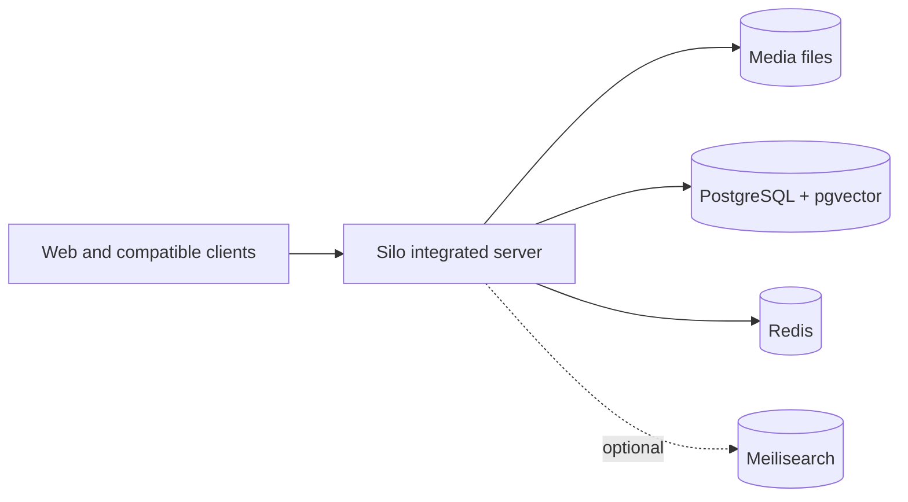

# Deploy Silo with Docker

Docker Compose is the recommended way to run Silo. The repository's default
stack targets a new single-host installation and includes:

- Silo in `integrated` mode
- PostgreSQL 18 with pgvector
- Redis
- FFmpeg and the Silo web application in the Silo image

Start here unless you already run PostgreSQL and Redis elsewhere or need
dedicated delivery nodes.



## Requirements

- Docker Engine or Docker Desktop
- Docker Compose 2.24 or newer
- Git and OpenSSL for the quick-start commands
- An absolute host path containing your media

For hardware acceleration, the host must also have the appropriate GPU driver
and container runtime support.

## Initial configuration

Clone the repository and create `.env` from the example:

```sh
git clone https://github.com/Silo-Server/silo-server.git
cd silo-server
cp .env.example .env
chmod 600 .env
printf '\nPOSTGRES_PASSWORD=%s\nSECRET_KEY=%s\n' \
  "$(openssl rand -hex 24)" "$(openssl rand -base64 48)" >> .env
```

Set the host path to your media:

```dotenv
MEDIA_ROOT=/path/to/your/media
```

Then start the stack:

```sh
docker compose up -d
```

Open <http://localhost:8090> and complete onboarding. The Compose stack wires
the PostgreSQL and Redis connections; everything else (libraries, users,
providers, storage, search, playback) is configured in the admin interface.

> [!CAUTION]
> `SECRET_KEY` is the master key for encrypted server-owned credentials. Keep it
> secret and back it up separately from database dumps. Losing it makes stored
> integration and storage credentials unrecoverable.

Design notes: [Secret encryption at rest](../../architecture/secret-encryption.md).

## Container image selection

The default `.env.example` follows `ghcr.io/silo-server/silo-server:latest`.
Before the first release, successful default-branch publications also receive
an ordered `build-N` tag and a short commit-SHA tag.

Use `SILO_IMAGE` to select an image:

```dotenv
SILO_IMAGE=ghcr.io/silo-server/silo-server:build-N
```

Use a commit-SHA tag or digest when a deployment or rollback target must not
move. [Release versioning](../../release-versioning.md) defines each tag.

## Storage and state

The deployment Compose files use host bind mounts rather than Docker-managed
volumes. `SILO_DATA_ROOT` defaults to `/opt/silo` and contains:

| Host path | Purpose |
| --- | --- |
| `/opt/silo/postgres` | Durable PostgreSQL data |
| `/opt/silo/redis` | Redis persistence |
| `/opt/silo/plugins` | Installed plugin cache |
| `/opt/silo/compat` | Compatibility assets |
| `/opt/silo/transcode` | Transient transcode output mounted at `/tmp/silo-transcode` |
| `/opt/silo/catalog-seeds` | Read-only catalog seed data |
| `/opt/silo/meilisearch` | Optional Meilisearch index |

To use a different base path:

```dotenv
SILO_DATA_ROOT=/srv/silo
```

`MEDIA_ROOT` is mounted read-only at `MEDIA_CONTAINER_ROOT`, which defaults to
`/mnt/media`. Existing installations must preserve the in-container path stored
in their library records.

Durable application state lives in PostgreSQL. Redis holds coordination and
cache-style data. Transcode output is local and transient. If
`userdb.backend=sqlite` is selected, local user state is also written under
`/var/lib/silo/userdb` and must be included in the deployment's persistence and
backup design.

The default Compose file does not persist that SQLite path. Before enabling the
SQLite backend, add this volume to the `silo` service in a deployment override:

```yaml
services:
  silo:
    volumes:
      - ${SILO_DATA_ROOT:-/opt/silo}/userdb:/var/lib/silo/userdb
```

Validate the merged Compose configuration before recreating the container.

### Published ports

Change the host-side port variables in `.env` when a default conflicts with
another service. The container listeners are fixed.

| Variable | Default | Purpose |
| --- | ---: | --- |
| `PORT` | `8090` | Main web application and API |
| `JF_PORT` | `8096` | Jellyfin/Emby compatibility listener |
| `ABS_PORT` | `13378` | Audiobookshelf compatibility listener |
| `PROXY_PORT` | `8083` | Commented standalone proxy example |
| `TRANSCODE_PORT` | `8082` | Commented standalone transcode example |

The Jellyfin/Emby and Audiobookshelf listeners are enabled by default, so
`8096` and `13378` accept connections from the first start. Turn them off in
**Admin > Settings** (`jellyfin_compat.enabled`, `audiobookshelf_compat.enabled`)
if you do not use compatible clients.

> [!WARNING]
> The application and compatibility port mappings listen on all host interfaces
> by default and do not provide TLS themselves. Before allowing access beyond a
> trusted local network, use a correctly configured HTTPS reverse proxy and
> firewall, then set `SILO_PUBLIC_URL` and `SILO_TRUSTED_PROXIES` for that
> deployment. Do not expose PostgreSQL or Redis publicly.

## Hardware acceleration

The default stack is CPU-only so it starts on hosts without a GPU.

### Intel or AMD VA-API and Intel Quick Sync

On a Linux host with `/dev/dri`, add the VA-API overlay:

```sh
docker compose \
  -f docker-compose.yml \
  -f docker-compose.vaapi.yml \
  up -d
```

To make the overlay the default for this installation:

```dotenv
COMPOSE_FILE=docker-compose.yml:docker-compose.vaapi.yml
```

### NVIDIA NVENC

Install the NVIDIA driver and NVIDIA Container Toolkit first, then use the
NVIDIA overlay:

```sh
docker compose \
  -f docker-compose.yml \
  -f docker-compose.nvidia.yml \
  up -d
```

To make it the default for this installation:

```dotenv
COMPOSE_FILE=docker-compose.yml:docker-compose.nvidia.yml
NVIDIA_GPU_COUNT=1
```

Windows uses `;` instead of `:` between entries in `COMPOSE_FILE`.

## Node metrics

Every Silo process — the API host and each proxy or transcode node — samples its
own CPU, memory, disk, network and GPU usage every five seconds. The numbers
appear on the admin Nodes page, in each node's `/health` and `/status`
responses, and as `streamapp_node_*` gauges on that process's `/metrics`
endpoint. `/metrics` is unauthenticated on node listeners, matching the API
listener; it exposes host resource counters, not media. Disk series are labeled
by role — `mount="scratch"`, `mount="library-1"` — rather than by path, so an
anonymous scrape cannot enumerate where your media lives. A node's `/health` is
unauthenticated for the same reason and withholds paths on the same terms. The
paths themselves are reported by the admin-authenticated
`GET /api/v1/admin/system/resources` and by each node's bearer-authed `/status`.

At most eight mounts are sampled per host — the transcode scratch directory
first, then library roots in order. The cap bounds probing, not just reporting:
each mount costs a `statfs` call per interval, and one on an unresponsive
network mount cannot be interrupted. A deployment with more roots than that logs
how many go unsampled rather than quietly reporting a subset.

Sampling is current-sample only. Silo stores no history — point Prometheus at
`/metrics` if you want trends or alerts.

**Works out of the box.** System metrics and per-device GPU busyness need no
extra packages, no privileges and no configuration. GPU usage comes from DRM
fdinfo, which the kernel exposes for any process holding a `/dev/dri` device, so
the standard VA-API overlay above is enough for Intel (i915, xe) and AMD
(amdgpu). It measures Silo's own ffmpeg processes only: a GPU shared with
something outside Silo will read as less busy than it is. Each device reports a
`source` field saying which measurement it used.

**NVIDIA needs the container toolkit.** The proprietary driver implements no
fdinfo, so `nvidia-smi` is the only signal — and it is a whole-GPU one, so it
also sees other tenants. It is already required for NVENC, so the NVIDIA overlay
above gives you GPU utilization, encoder/decoder utilization and VRAM with no
extra step. If the binary is missing or fails repeatedly, that device reports
`source: unavailable` and nothing else degrades.

**Whole-GPU Intel sampling is not implemented yet.** Reading Intel utilization
across all tenants needs `intel_gpu_top`, which requires `CAP_PERFMON` (or root)
plus a permissive `kernel.perf_event_paranoid` — privileges a plain `/dev/dri`
passthrough container does not have and should not be given by default. Until
that lands, Intel GPUs report the fdinfo baseline only, and `total_busy_pct` is
absent rather than zero.

**What the numbers mean inside a container.** `/proc/stat` and `/proc/meminfo`
describe the *host*, not the container, so Silo corrects both against the
container's cgroup. Memory reports the cgroup limit and working set (page cache
excluded), which is what the kernel will OOM-kill against. CPU reports the
cgroup's own consumption against its own quota, so a container limited to
`cpus: 2` on a 64-core host reads 100% when it is pegged — not the 3% of the
host machine that same work amounts to — and `cores` is the quota, not the
host's core count. `/proc/net/dev` is
already per-namespace, so network throughput is the container's own traffic.
Disk figures come from `statfs` on the paths the container can see — the
transcode scratch directory on every node, plus the configured library roots on
the API host. A mount that stops responding reports its last good numbers marked
`stale` and never delays a health response; a path a node cannot see at all is
reported `unavailable` rather than as an empty disk.

**LXC hosts running Docker nested inside them.** The cgroup correction above
only works when the limit is visible on *this* container's own cgroup. On an
LXC host, a Docker container nested inside the LXC sees the raw kernel's
`/proc/stat`, `/proc/loadavg`, and `/proc/meminfo` — the physical machine's
totals, not the LXC's — while its own cgroup shows no limit at all, because the
LXC's cap lives on an ancestor cgroup outside the nested container's namespace.
lxcfs, which every LXC container mounts for exactly these files, virtualizes
them to the LXC's own limits, so bind-mounting that virtualized view into the
Docker container fixes it:

```yaml
volumes:
  - /proc/meminfo:/host/proc/meminfo:ro
  - /proc/stat:/host/proc/stat:ro
  - /proc/loadavg:/host/proc/loadavg:ro
```

No setting turns this on: the sampler uses each file under `/host/proc` when it
is present and falls back to its own `/proc` when it is not, per file, so the
mounts take effect on the next sample and removing one reverts it.

These three mounts are only useful when the Docker host is itself an LXC/lxcfs
container — a bare-metal or VM Docker host has nothing extra to gain from them,
since its own `/proc` is already correct or already cgroup-corrected. Without
them, a node running nested this way reports the bare-metal host's CPU, memory,
and load totals instead of its own.

One caveat: lxcfs only virtualizes `/proc/loadavg` when it runs with loadavg
accounting enabled (its `-l` flag; on Proxmox, `lxcfs` defaults to off). With
it off, cores and memory are container-scoped but `load1` remains the physical
host's — visibly higher than the container's core count under host contention.

## Optional Meilisearch

PostgreSQL full-text search needs no extra service. To offer Meilisearch as an
alternative provider:

1. Generate a key and add it to `.env`:

   ```sh
   openssl rand -hex 32
   ```

   ```dotenv
   MEILI_MASTER_KEY=replace-with-generated-value
   ```

2. Start the `search` profile:

   ```sh
   docker compose --profile search up -d
   ```

3. In **Admin > Settings > Search**, select Meilisearch, set the URL to
   `http://meilisearch:7700`, enter the same key as the API key, test the
   connection, and save.
4. Restart Silo. Background search maintenance builds the catalog search index
   automatically and retries failures every minute. The Search status panel
   shows whether Meilisearch, keyword-only Meilisearch, or PostgreSQL is serving
   requests while the build runs; the manual rebuild action remains available.

Silo continues to use PostgreSQL full-text search until Meilisearch is selected.
Settings that change the index format, including enabling meaning-based search,
also trigger an automatic background rebuild after restart. A compatible older
Meilisearch index keeps serving keyword results while its replacement is built.

## External PostgreSQL and Redis

> [!IMPORTANT]
> The default `docker-compose.yml` defines bundled PostgreSQL and Redis services,
> hard-codes the Silo service's internal connection URLs, and declares health
> dependencies on both services. Setting `DATABASE_URL` or `REDIS_URL` only in
> `.env` does not replace that wiring.

To use existing infrastructure, write a Compose definition or override that
does all of the following:

- supplies the external `DATABASE_URL` and `REDIS_URL` to the Silo service
- removes or replaces the bundled-service dependencies
- omits the bundled PostgreSQL and Redis services from the deployed project
- preserves the media, plugin, compatibility, transcode, and catalog mounts
- preserves the same `SECRET_KEY` across every Silo role

Validate the merged configuration before starting it:

```sh
docker compose -f docker-compose.yml -f your-override.yml config --quiet
```

Running PostgreSQL on a dedicated VM or managed service simplifies upgrades,
tuning, and backups. Redis can stay local or move to shared infrastructure if
you already have it.

## Server roles and distributed deployments

| Mode | Purpose |
| --- | --- |
| `integrated` | Recommended primary server with the API, frontend, scanners, workers, and configured local delivery. |
| `api` | Primary/control role for a custom distributed topology; configured local transcode fallback may still be used. |
| `proxy` | Dedicated stream and source-download delivery node. |
| `transcode` | Dedicated HLS and prepared-download worker. |

The main Compose file contains commented proxy and transcode examples. Leave
them disabled on a single host; `integrated` already proxies and transcodes.

For a distributed deployment:

- connect roles to the deployment's PostgreSQL and Redis infrastructure
- use the same `SECRET_KEY` on every role
- expose the same absolute source-media paths to processes that serve them
- persist the configured prepared-download artifact directory on every process
  that can prepare downloads
- restart a role after changing its artifact path

Prepared downloads can run on transcode nodes. The node keeps the result on
its own disk and serves it through Silo's authenticated artifact API, so nodes
need no shared artifact mount. Dedicated transcode nodes default to a protected
directory inside the transcode volume; `download.artifact_dir` overrides that
for transcode nodes and for the integrated/API fallback. Whatever path you
configure must be mounted on every process that can prepare downloads.

Downloads with a server-wide or per-user bandwidth limit are always served by
the API server, so the limits stay exact regardless of topology. The
client-facing contract is in the [Downloads API](../../downloads-api.md#411-distributed-proxy-delivery).

## PostgreSQL auto-tuning

The bundled deployment enables Silo's
[pgtune](https://github.com/le0pard/pgtune)-style OLTP tuning by default:

```yaml
POSTGRES_TUNE: auto
```

> [!CAUTION]
> With auto-tuning enabled, Silo uses `ALTER SYSTEM` and writes recommendations
> to PostgreSQL's `postgresql.auto.conf`. Set `POSTGRES_TUNE=off` before startup
> if PostgreSQL settings are managed elsewhere.

Reloadable settings are applied with `pg_reload_conf()`. Restart-only settings
are written to `postgresql.auto.conf` and logged by name on every Silo start
until PostgreSQL has been restarted. Silo is already serving when that warning
appears, and restarting only PostgreSQL drops every open Silo connection, so
restart both during a quiet window (or once, right after first boot, before
adding libraries):

```sh
docker compose restart postgres silo
```

The bundled database user has the required permissions. For an external
database, keep `POSTGRES_TUNE=off` for the application credential and manage
tuning out of band with a separate administrative credential. Silo uses the
`DATABASE_URL` identity for both normal operation and tuning; it does not have
a separate tuning credential. Granting that identity `ALTER SYSTEM` permits
server-wide configuration changes if the application credential is
compromised.

Enable external tuning only in a trusted deployment that accepts this risk. Set
explicit `POSTGRES_TUNE_MEMORY` and `POSTGRES_TUNE_CPUS` values for the database
host and grant the `DATABASE_URL` user permission to run `ALTER SYSTEM`;
automatic host detection describes the Silo container, not a remote database
machine.

When `POSTGRES_TUNE_MEMORY=auto`, Silo uses the first trustworthy source from a
finite Docker cgroup limit, the bundled read-only `/host/proc/meminfo` mount,
or guarded `/proc/meminfo` detection. It reserves 25% of detected memory for
Silo, Redis, plugins, transcodes, the operating system, and other work by
default. Database-size classification uses
`pg_database_size(current_database())`.

| Variable | Default | Description |
| --- | ---: | --- |
| `POSTGRES_TUNE_PROFILE` | `oltp` | Tuning profile; only `oltp` is currently supported. |
| `POSTGRES_TUNE_MEMORY` | `auto` | Server or container RAM, such as `8GB` or `32GB`; explicit values are used as-is. |
| `POSTGRES_TUNE_MEMORY_BUDGET_PERCENT` | `75` | Percentage of auto-detected RAM used for PostgreSQL recommendations. |
| `POSTGRES_TUNE_CPUS` | `auto` | CPU count used for worker recommendations. |
| `POSTGRES_TUNE_STORAGE` | `ssd` | One of `hdd`, `ssd`, `san`, or `nvme`. |
| `POSTGRES_TUNE_DB_SIZE` | `auto` | Automatic classification, or `less_ram`, `mid_ram`, or `greater_ram`. |
| `POSTGRES_TUNE_CONNECTIONS` | `100` | PostgreSQL `max_connections`; raised when the Silo application pool is larger. |
| `POSTGRES_SHM_SIZE` | `8gb` | Docker `/dev/shm` size for bundled PostgreSQL. |

Turning auto-tuning off does not remove settings already written to
`postgresql.auto.conf`. Reset them yourself if you later move to a fully custom
configuration.

## Backups and updates

Before an update:

1. Record the image currently running (`docker compose images silo`) so you
   can roll back to it. `latest` will not identify it later.
2. Dump PostgreSQL and check the dump is readable:

   ```sh
   docker compose exec -T postgres \
     pg_dump -U "${POSTGRES_USER:-silo}" -Fc "${POSTGRES_DB:-silo}" > silo-$(date +%F).dump
   pg_restore --list silo-$(date +%F).dump > /dev/null
   ```

   Do not copy `/opt/silo/postgres` while the container is running; a live
   copy of the data directory is inconsistent and may not start. If you must
   copy the directory, `docker compose stop postgres` first.
3. Back up `.env`, especially `SECRET_KEY`, separately from the dump.
4. Keep the effective Compose configuration and any overrides with the backup,
   in a restricted location.
5. Read the incoming build or release notes for migration and compatibility
   changes.

Set the intended `SILO_IMAGE`, then update only the application service:

```sh
docker compose pull silo
docker compose up -d --no-deps silo
docker compose logs -f silo
```

Silo applies pending migrations during startup, under a database lock, before
it opens its HTTP listener. The container healthcheck starts failing after
about a minute, so a large migration can show `unhealthy` in `docker ps` while
it is still working. Follow the logs until startup completes and do not
restart the container during a migration: that abandons the run and can leave
a lock-holding backend behind. Migrations time out after 20 minutes by default;
raise `SILO_MIGRATE_TIMEOUT` (a Go duration such as `60m`, or `0` for no limit)
for very large libraries.

> [!WARNING]
> Rolling back the image does not reverse migrations. Check what was applied
> with `docker compose run --rm silo --migrate-status`. For a reversible
> migration, stop the stack and run
> `docker compose run --rm silo --migrate-down-to <version>` before starting
> the previous image; some migrations discard data on the way down, so read the
> migration first. Restoring the pre-update dump is the fallback, and it
> discards every write made after the dump.

`docker compose config` output contains resolved database credentials and
`SECRET_KEY`. Restrict its permissions, never paste it into issues or logs, and
redact it before sharing.

After an update, check both endpoints on the host-side `PORT` (replace `8090`
if you changed it):

```sh
curl -fsS http://localhost:8090/api/v1/health
curl -fsS http://localhost:8090/api/v1/ready
```

`health` reports process liveness. `ready` also checks required dependencies,
including PostgreSQL and configured S3 storage.

## Migrating from Continuum

Follow [Continuum to Silo Docker Migration](../../continuum-to-silo-docker-migration.md).
Keep the old in-container media path if existing library records store it, and
keep the migration backup until scanning, metadata, users, plugins, and
playback have all been checked.

## Source References

- [`docker-compose.yml`](../../../docker-compose.yml)
- [`docker-compose.vaapi.yml`](../../../docker-compose.vaapi.yml)
- [`docker-compose.nvidia.yml`](../../../docker-compose.nvidia.yml)
- [`.env.example`](../../../.env.example)
- [Release versioning](../../release-versioning.md)
- [Downloads API](../../downloads-api.md)
- [S3 storage setup](../../s3-storage-setup.md)
